# changhangtong
vue.js+node.js毕业设计 -----
## 线上演示
http://www.guoang.xyz/changhangtong 
http://www.guoang.xyz/changhangtong/admin

# 主要功能模块
- 前台
  * 问答
  * 活动
  * 失物认领
  * 二手交易
  * 招聘信息
  * 文章与新闻
  * 个人中心&&登录注册
    + 个人中心
     * 问答
       *  发布
        * 管理 
      * 活动
         *  发布
        * 管理 
     * 失物认领
        *  发布
        * 管理 
    * 二手交易
           *  发布
        * 管理 
     * 招聘信息
        *  发布
        * 管理 
    *   文章与新闻
        *  发布
        * 管理 
 * 后台
     * 仪表盘
     * 审核中心
        * 问答 /活动/失物认领/ 二手交易/招聘信息/ 文章与新闻
        * 留言审核
     * 认证中心
       * 学生认证
       * 公司认证
     * 客服中心
     * 平台管理
           分类管理
     * 账号管理
             账号添加/删除/授权/

# 前台   
## 前台-首页
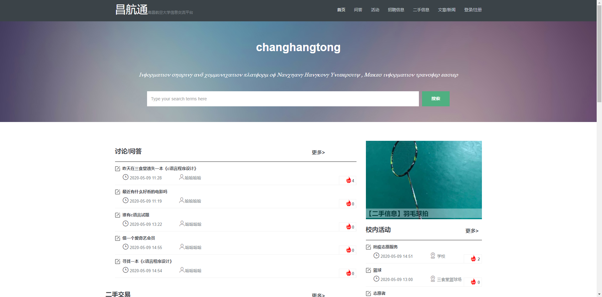 

## 前台-功能模块
|                                                                                     |                                           |
| ----------- | --------------- |
|    交流问答列表核                                                       | 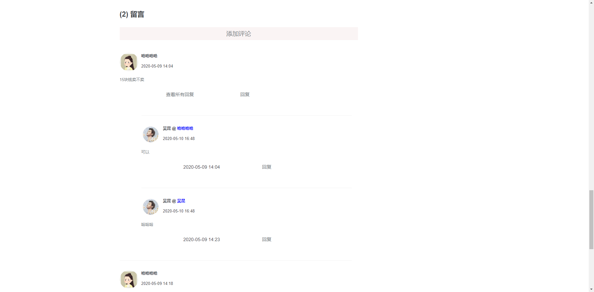 评论        |
| ----------- | --------------- |
|    校内活动列表核                                                       | 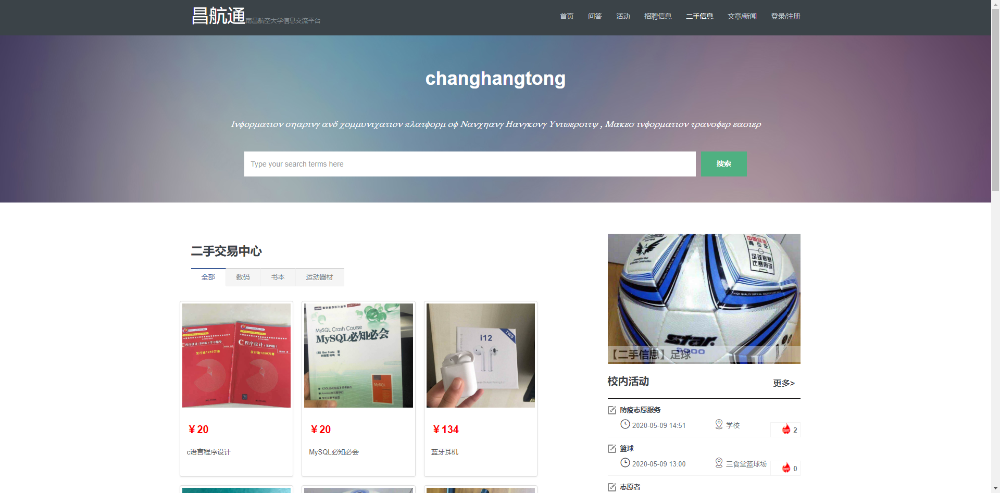 二手信息列表         |
| ----------- | --------------- |
|    招聘列表核                                                       | 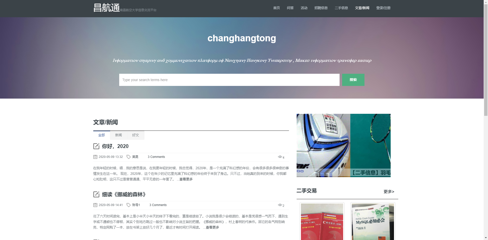 文章列表         |
## 前台-个人中心
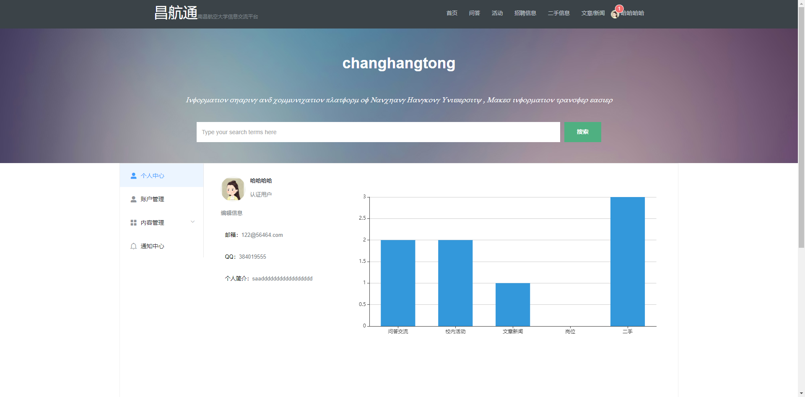  

# 后台   
## 后台-首页
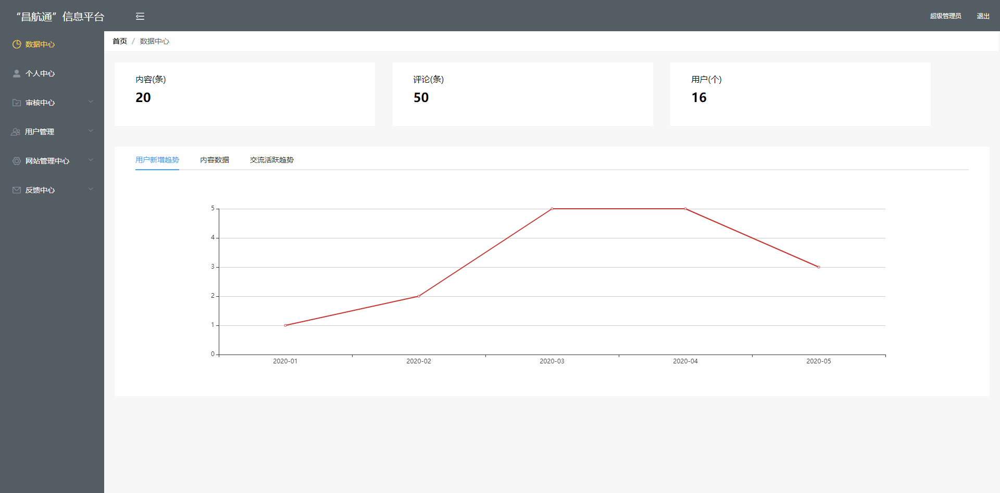   

## 后台-个人中心
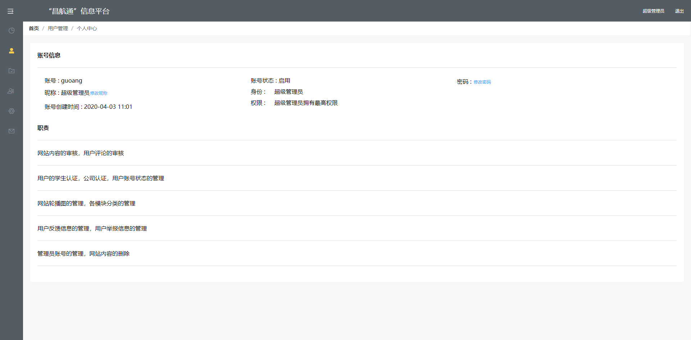 

## 后台-审核中心
|                                                                                     |                                           |
| --------------------------------------------------------------------------------------- | ------------------------------------------- |
| 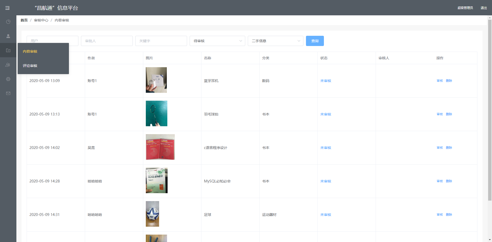   内容审核                                                       | 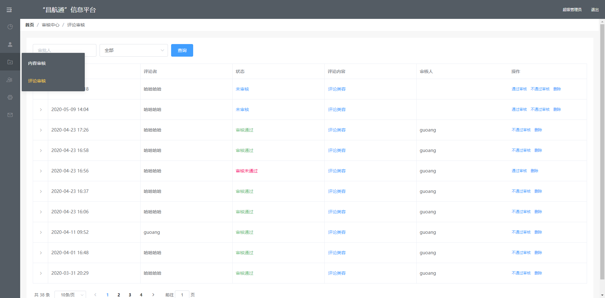 评论审核          |

 

## 后台-用户中心

|                                                                                     |                                           |
| --------------------------------------------------------------------------------------- | ------------------------------------------- |
|  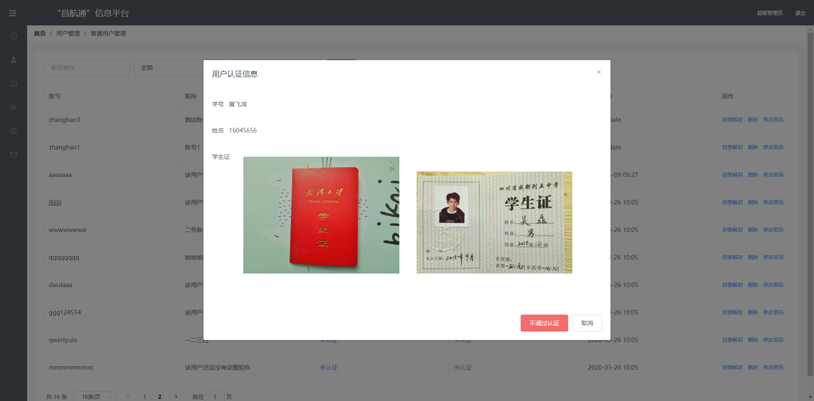普通用户管理                                                       | 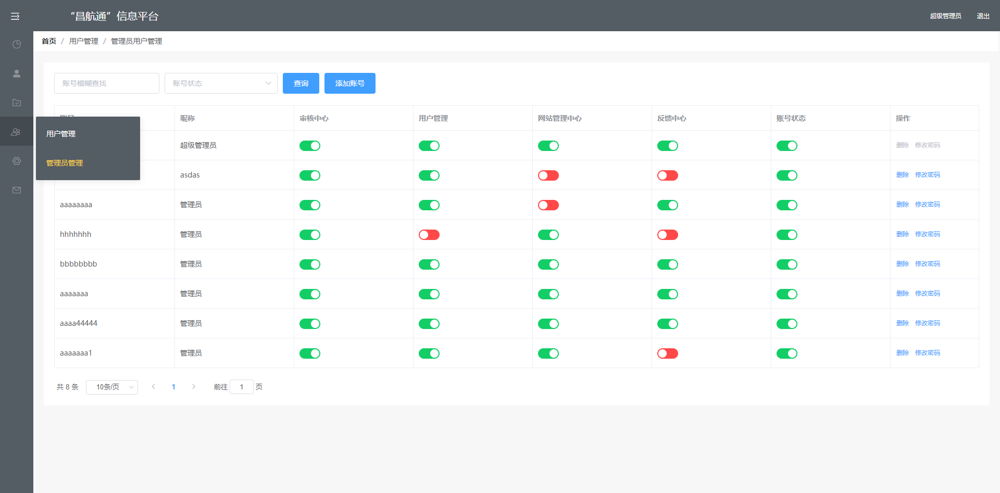 管理员账号管理          |

## 后台-网站管理中心

|                                                                                     |                                           |
| --------------------------------------------------------------------------------------- | ------------------------------------------- |
| 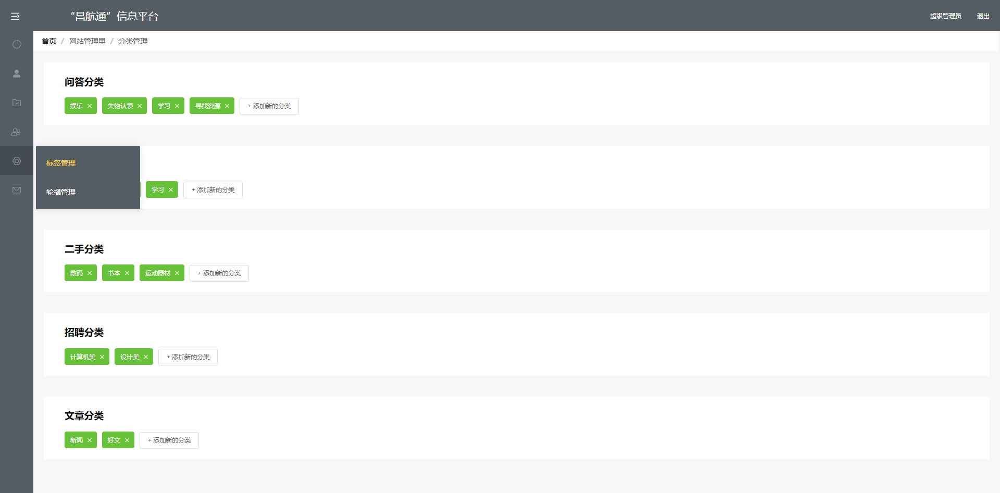分类管理                                                       | 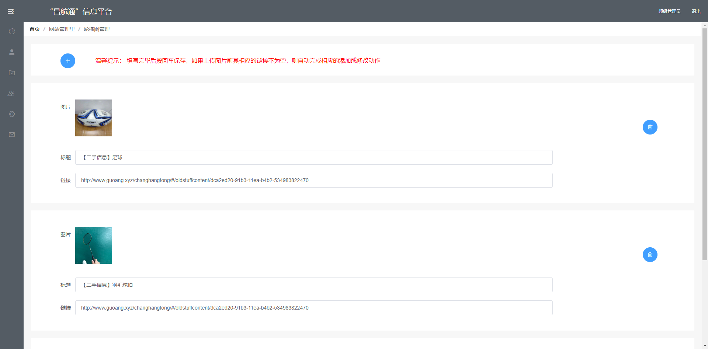 轮播图管理        |

## 数据库设计
###### user表
字段名    | 描述
-------- | -----
 user_id| 用户id
username  | 用户名
password|密码
nickname|昵称
avatar|头像
realstate|是否学生认证
realname|姓名
studentid|学号
studentcard|学生证
iscompany|是否公司
qq|QQ
mail|邮箱
describe|描述
###### notice表
| 字段 | 含义      |
|:--------:| -------------:|
| notice_id | 消息 id |
|user_from|发起者
|user_to|接受者
|action|动作
|content_id|内容id
|router|路由
|createtime|时间
|state|状态